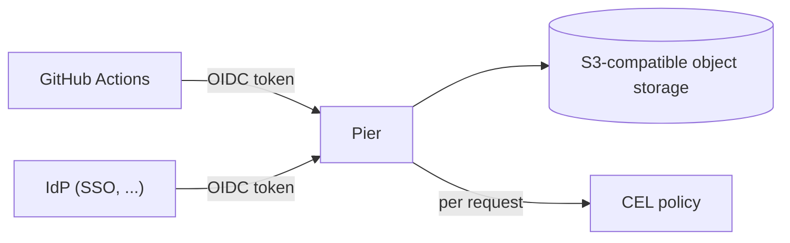

# Pier

A private Maven repository on top of S3-compatible object
storage, fitting in one stateless Go binary.

- **Every request** carries an OIDC token. Pier authorizes the request
  only after it verifies the token against the configured issuers — no
  deploy tokens, no shared secrets. GitHub
  Actions OIDC (trusted publishing) is one example of a source; so is
  any IdP you configure (Authentik, Keycloak, ...).
- Authorization uses a list of **CEL rules**. Pier evaluates the rules
  per request against the verified token claims, the Maven coordinates
  of the path, and the action (`download` / `upload` / `delete`). The
  token source does not decide; the rules do.

## Maven protocol

The service speaks the plain-HTTP Maven repository layout:

| Operation | HTTP | Path |
|-----------|------|------|
| resolve artifact | `GET`/`HEAD` | `com/example/foo/1.0.0/foo-1.0.0.jar` |
| resolve metadata | `GET`/`HEAD` | `com/example/foo/maven-metadata.xml` |
| deploy artifact/pom | `PUT` | same as above |
| deploy metadata | `POST` (or `PUT`) | `com/example/foo/maven-metadata.xml` |
| deploy checksum | `PUT`/`POST` | `...jar.sha1` (also `.md5`, `.sha256`, `.sha512`) |
| delete | `DELETE` | any of the above |

Behavior notes:

- Downloads support HTTP byte ranges (`Range: bytes=...`). Satisfiable
  ranges return `206 Partial Content` with `Content-Range`, so a client
  can fetch large artifacts partially or resume an interrupted download;
  unsatisfiable ranges return `416`.
- Pier stores `maven-metadata.xml` exactly as the deploy client sends it
  (the Maven deploy plugin generates the full XML, including snapshot
  versions). If it is missing: for a private GAV, Pier synthesizes the
  artifact-level document from the stored versions
  ([Pull-through cache](pull-through.md)); Pier never synthesizes
  snapshot-level metadata (`404` if absent). For a pull-through GAV,
  Pier fetches the upstream's document through the cache.
- Pier **verifies checksum uploads against the stored base object**: it
  rejects a mismatch with `409`, so a broken deploy cannot poison the
  repo. The base object must exist first.
- Non-SNAPSHOT objects are **immutable** by default (`immutable_releases:
  true`): re-uploading a published GAV (`groupId:artifactId:version`)
  returns `409`. You can re-upload snapshots and `maven-metadata.xml`.
- `401` = missing/invalid token (the body states the reason, for example
  `audience mismatch`, `token expired`, `JWKS unavailable`); `403` =
  valid token, no rule allows the action.
